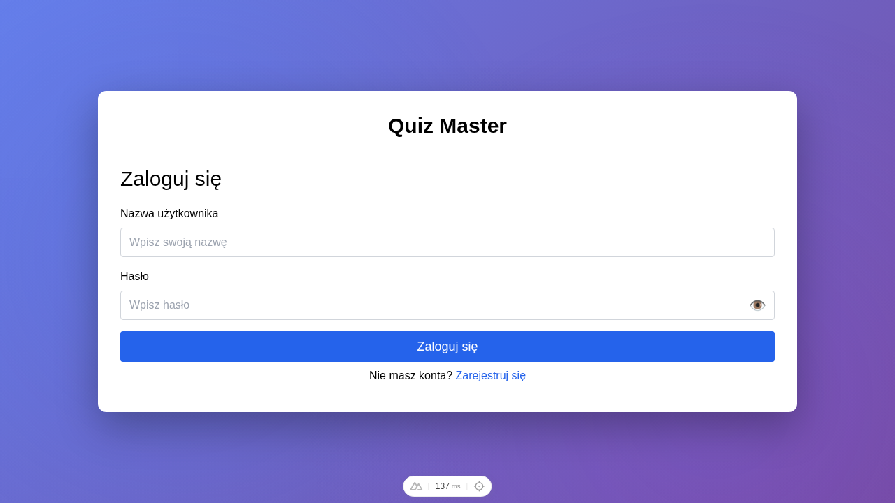
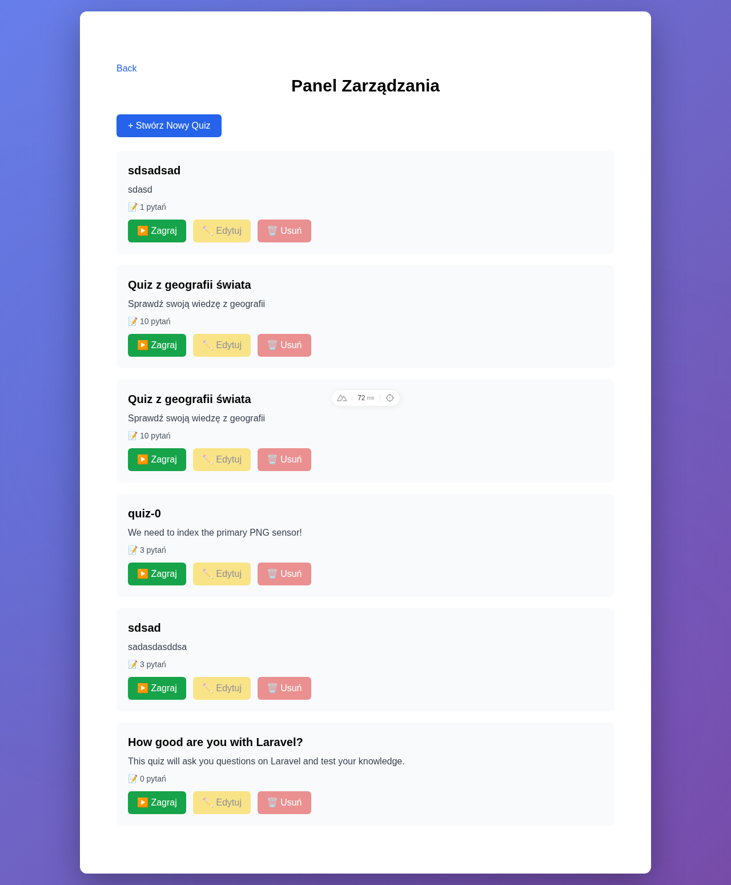
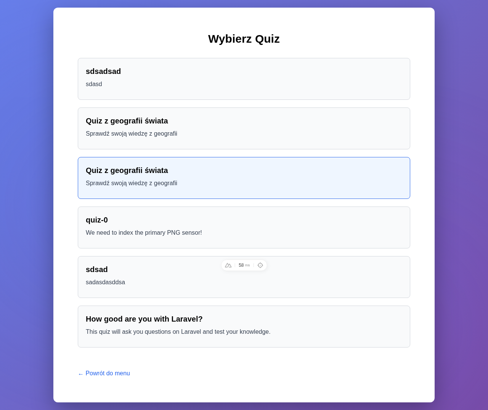
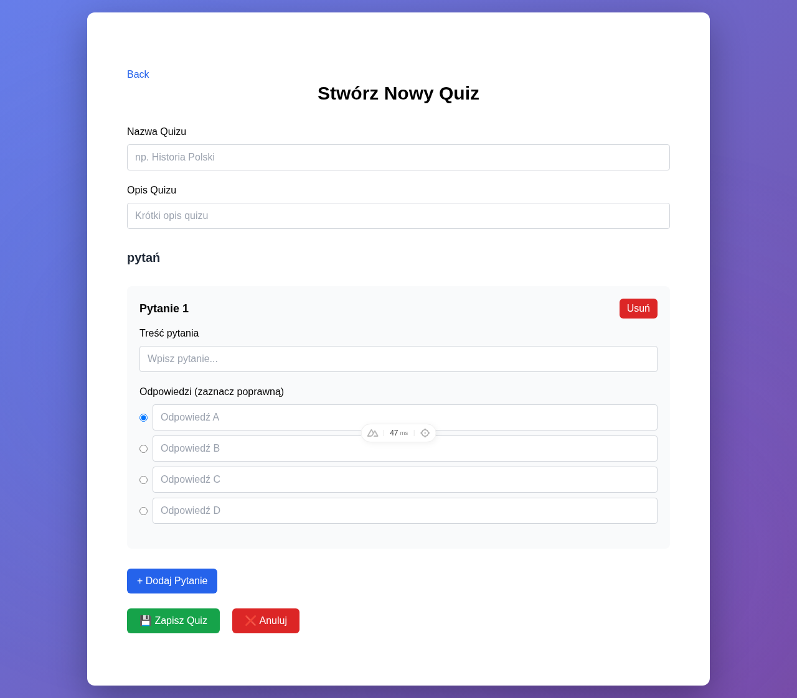

<div align="center">

# 🧠 Random Quiz Generator

A full-stack quiz application where users can browse, play, and submit quizzes while admins manage content through a dedicated dashboard. Built as a monorepo with a modern TypeScript stack.


<!-- TODO: Uncomment when deployed -->
<!-- [🔗 Live Demo](https://your-demo-url.com) -->

</div>

---

## 📸 Screenshots

| Login | Dashboard | Quiz Selection | Create Quiz |
|:-:|:-:|:-:|:-:|
|  |  |  |  |

> Screenshots can be auto-generated with Playwright — see [Generating Screenshots](#-generating-screenshots).

---

## ✨ Features

- **🔐 JWT Authentication** — Access & refresh tokens stored in HTTP-only cookies
- **📝 Quiz Management** — Admins can create quizzes with questions and answer options
- **🎮 Quiz Playing** — Browse available quizzes, play, and submit responses
- **📊 Dashboard** — Overview of available quizzes and results
- **🌍 Internationalization** — i18n support with Polish locale
- **📖 Swagger API Docs** — Auto-generated OpenAPI documentation at `/api`
- **🔒 Role-based Access** — Admin and user roles with server-side guards
- **📄 Pagination** — Paginated API responses for quiz listings

---

## 🏗️ Tech Stack

| Layer | Technology |
|---|---|
| **Frontend** | Nuxt 4, Tailwind CSS, Sass, Pinia |
| **Backend** | NestJS 8, TypeORM, PostgreSQL 15 |
| **Auth** | JWT (access + refresh tokens), Passport.js |
| **Monorepo** | Turborepo, pnpm Workspaces |
| **Testing** | Vitest (unit), Playwright (E2E) |
| **API Docs** | Swagger / OpenAPI (`@nestjs/swagger`) |
| **DevOps** | Docker Compose, multi-stage Dockerfile |
| **Code Quality** | ESLint, Prettier, TypeScript strict mode |

---

## 📁 Project Structure

```
random-quiz-generator/
├── apps/
│   ├── backend/                 # NestJS REST API
│   │   └── src/
│   │       ├── config/          # TypeORM & app configuration
│   │       ├── database/        # ORM entities, migrations, seeds
│   │       ├── common/          # Guards, middleware, decorators, DTOs
│   │       └── modules/
│   │           ├── auth/        # JWT authentication & role guards
│   │           ├── quiz/        # Quiz, question, option & response CRUD
│   │           └── user/        # User management (DDD-style layers)
│   └── frontend/                # Nuxt 4 application (layer-based)
│       └── apps/
│           ├── core/            # Layouts, i18n, plugins, assets, middleware
│           ├── base/            # Pages: dashboard, quiz selection, playing, create
│           └── auth/            # Pages: login, signup
├── packages/
│   ├── shared-types/            # Shared TypeScript DTOs (UserDTO, QuizDTO)
│   └── shared-utils/            # Shared utility functions
├── e2e/                         # Playwright end-to-end tests
├── docker-compose.yaml          # PostgreSQL dev database
├── turbo.json                   # Turborepo pipeline config
└── playwright.config.ts         # E2E test config
```

---

## 🚀 Getting Started

### Prerequisites

- **Node.js** ≥ 18
- **pnpm** ≥ 9 — `corepack enable && corepack prepare pnpm@9.7.0 --activate`
- **Docker** & **Docker Compose** — for the PostgreSQL database

### Installation

```bash
# 1. Clone the repository
git clone https://github.com/<your-username>/random-quiz-generator.git
cd random-quiz-generator

# 2. Install dependencies
pnpm install

# 3. Start the PostgreSQL database
docker compose up -d

# 4. Configure environment variables
cp .env.example apps/backend/.env
# Edit apps/backend/.env with your values (see .env.example for details)

# 5. Run database migrations & seed
cd apps/backend
pnpm run migration:run
pnpm run seed
cd ../..

# 6. Start development servers (frontend + backend in parallel)
pnpm run dev
```

The application will be available at:

| Service | URL |
|---|---|
| Frontend (Nuxt) | http://localhost:3000 |
| Backend (NestJS) | http://localhost:3001 |
| Swagger API Docs | http://localhost:3001/api |

---

## 📜 Available Scripts

### Root (Monorepo)

| Command | Description |
|---|---|
| `pnpm run dev` | Start all apps in parallel (frontend + backend) |
| `pnpm run build` | Build all apps with Turborepo caching |
| `pnpm run lint` | Lint all packages |
| `pnpm run test` | Run unit tests across all packages |
| `pnpm run test:e2e` | Run Playwright E2E tests |
| `pnpm run test:e2e:ui` | Run E2E tests with Playwright UI |

### Backend (`apps/backend`)

| Command | Description |
|---|---|
| `pnpm run migration:run` | Run pending TypeORM migrations |
| `pnpm run migration:generate` | Auto-generate migration from entity changes |
| `pnpm run seed` | Seed the database with initial data |
| `pnpm run db:refresh` | Drop schema → run migrations → seed |

---

## 🔌 API Overview

All endpoints are documented via **Swagger UI** at [`http://localhost:3001/api`](http://localhost:3001/api).

### Key Endpoints

| Method | Endpoint | Auth | Description |
|---|---|---|---|
| `POST` | `/auth/login` | ❌ | Login and receive JWT tokens |
| `GET` | `/quiz` | 🔒 User | List quizzes (paginated) |
| `GET` | `/quiz/:id` | 🔒 User | Get quiz by ID |
| `POST` | `/quiz` | 🔒 Admin | Create a new quiz |
| `POST` | `/response` | 🔒 User | Submit quiz responses |
| `GET` | `/user/me` | 🔒 User | Get current user profile |

> Authenticated requests require a Bearer JWT token. Admin endpoints additionally require the `admin` role.

---

## 🧪 Testing

```bash
# Unit tests (Vitest)
pnpm run test

# E2E tests (Playwright — auto-starts backend & frontend)
pnpm run test:e2e

# E2E with interactive UI
pnpm run test:e2e:ui

# E2E in headed browser
pnpm run test:e2e:headed
```

### 📷 Generating Screenshots

Auto-generate screenshots for this README using Playwright:

```bash
pnpm run test:e2e -- e2e/screenshots.spec.ts
```

This navigates through key pages (login, dashboard, quiz selection, create quiz) and saves screenshots to `docs/screenshots/`. Requires a running database with seeded data.

---

## 🐳 Docker

### Development Database

```bash
docker compose up -d       # Start PostgreSQL
docker compose down         # Stop PostgreSQL
docker compose down -v      # Stop and remove volumes (reset data)
```

### Production Build (Backend)

The backend includes a multi-stage Dockerfile:

```bash
cd apps/backend
docker build --target production -t quiz-api .
docker run -p 3001:3001 --env-file .env quiz-api
```

---

## 🤝 Contributing

Contributions are welcome! Follow these steps:

1. **Fork** the repository
2. **Create** a feature branch — `git checkout -b feature/my-feature`
3. **Commit** using [Conventional Commits](https://www.conventionalcommits.org/) — `feat: add quiz timer`
4. **Push** to your branch — `git push origin feature/my-feature`
5. **Open** a Pull Request

### Code Style

- **ESLint** + **Prettier** configured — run `pnpm run lint` before committing
- **TypeScript strict mode** enabled across all packages

---

## 📄 License

This project is licensed under the **MIT License** — see the [LICENSE](LICENSE) file for details.

---

<div align="center">
  <sub>Built with ❤️ by Patryk Makuch using NestJS, Nuxt & Turborepo</sub>
</div>

